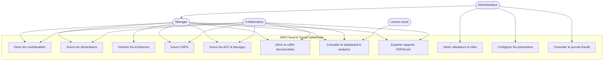
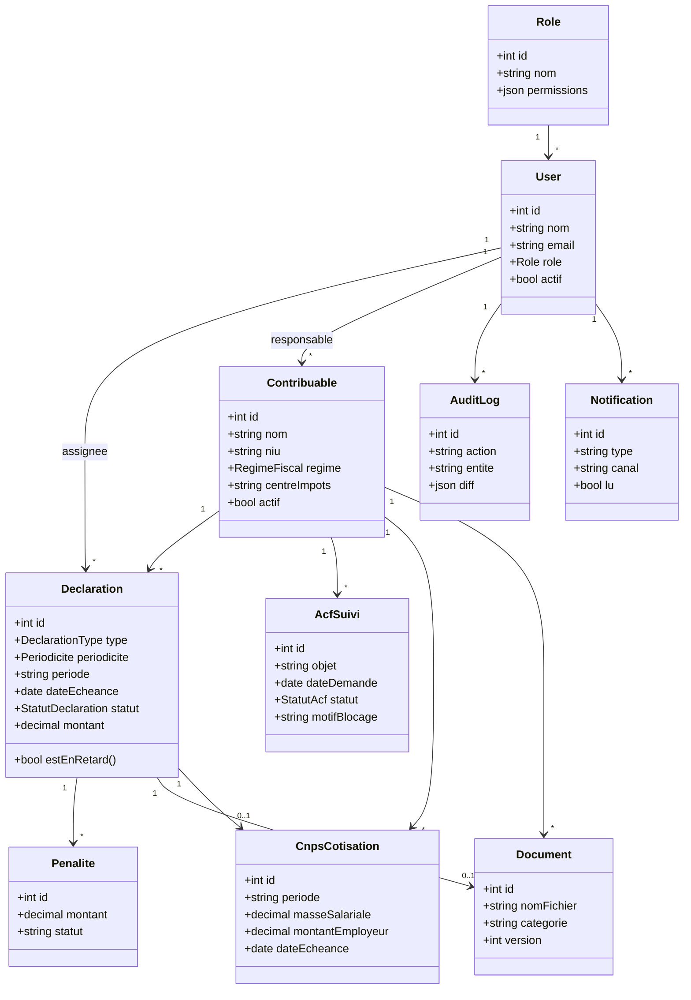
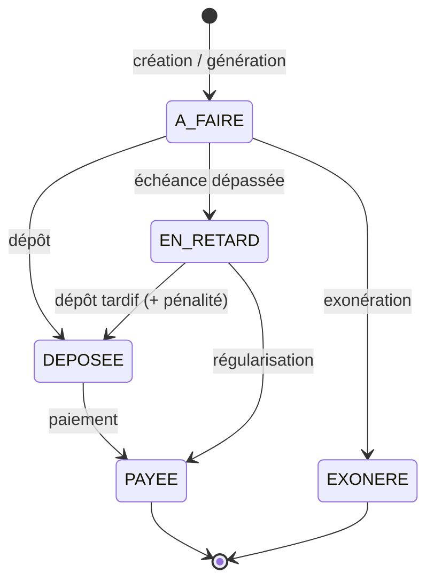
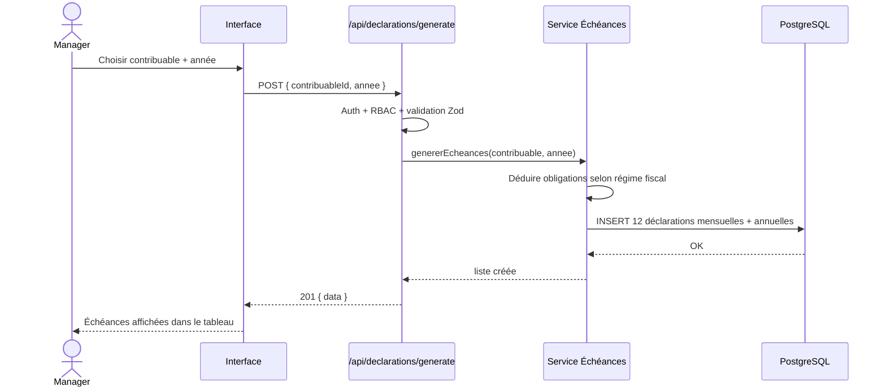
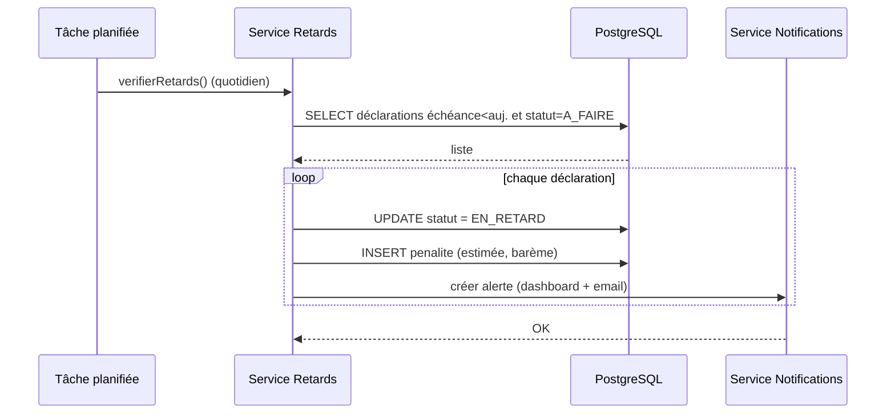

# Diagrammes UML & Cas d'Utilisation — ERP LaMethode

**Version :** 1.0 (Phase 1) · **Statut :** à valider
*(Diagrammes en syntaxe Mermaid — rendus par GitHub, VS Code, etc.)*

---

## 1. Diagramme de cas d'utilisation

> Admin hérite des droits Manager ; Manager hérite des droits Collaborateur ; tous héritent
> de la lecture. Les liens ci-dessus montrent les cas **spécifiques** à chaque niveau.

---

## 2. Diagramme de classes (modèle du domaine)

---

## 3. Diagramme d'état — cycle de vie d'une déclaration

---

## 4. Séquence — génération automatique des échéances mensuelles

---

## 5. Séquence — passage automatique en retard + pénalité

